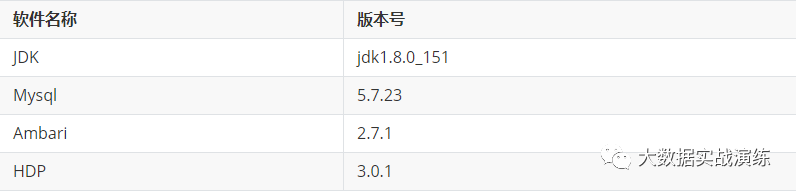
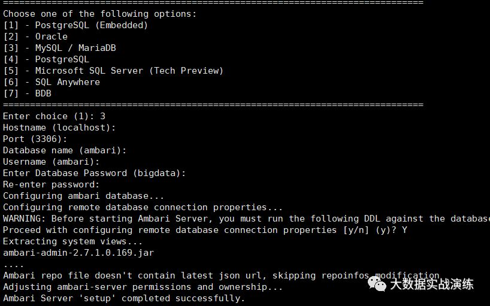

#  Ambari2.7安装配置

视频网址 https://www.bilibili.com/video/av80315899?t=16

## 1、配置环境说明

### 软件环境



## 二、修改主机名和hosts文件

### 1. 修改主机名（三台主机分别修改主机名）

```linux
# 使用hostnamectl命令修改主机名，执行该命令后立即生效，但必须需要重启Xshell连接
# 以其中一台为例，代码如下
hostnamectl set-hostname node1.ambari.com
```

### 2. 修改hosts文件（三台主机的hosts文件均修改为下图所示）

```linux
# 添加机器ip与主机名映射
vim /etc/hosts
##如下
10.180.249.66   chang-66
10.180.249.67   chang-67
10.180.249.68   chang-68
```

## 三、关闭防火墙和selinux

### 1. 防火墙设置

```linux
# 查看防火墙状态
systemctl status firewalld
# 查看开机是否启动防火墙服务
systemctl is-enabled firewalld
# 关闭防火墙
systemctl stop firewalld
systemctl disable firewalld
# 再次查看防火墙状态和开机防火墙是否启动
systemctl status firewalld
systemctl is-enabled firewalld
```

### 2. 禁用selinux

```
# 永久性关闭selinux（重启服务器生效）
sed -i 's/SELINUX=enforcing/SELINUX =disabled/' /etc/selinux/config
# 临时关闭selinux（立即生效，重启服务器失效）
setenforce 0
# 查看selinux状态
getenforce
# disabled为永久关闭，permissive为临时关闭，enforcing为开启
或者编辑
vim /etc/sysconfig/selinux 
```

## 四、免密登陆

```
	#生成ssh免登陆密钥
	#进入到我的home目录
	cd ~/.ssh
	ssh-keygen -t rsa （四个回车）
	执行完这个命令后，会生成两个文件id_rsa（私钥）、id_rsa.pub（公钥）
	将公钥拷贝到要免登陆的机器上
	ssh-copy-id root@chang-67
```


## 五、安装JDK

下载链接: https://pan.baidu.com/s/1rlqZejpZZqio9RPzgnGOEg 提取码: j47n ；内有`jdk-8u151-linux-x64.tar.gz`和`mysql-connector-java.jar`文件。

- mkdir /usr/java；将下载的压缩包上传到java文件夹内

- 解压压缩包：tar zxvf jdk-8u151-linux-x64.tar.gz

- 配置jdk环境变量：

  ```
  # 编辑/etc/profile,文末插入以下内容：
  # set java
  export JAVA_HOME=/usr/java/jdk1.8.0_151
  export PATH=$JAVA_HOME/bin:$PATH
  ```

  使环境变量生效：source /etc/profile

  安装验证：java -version

## 六、安装mysql

mysql5.7 centos7:

https://dev.mysql.com/get/mysql57-community-release-el7-11.noarch.rpm

mysql5.7 centos6:

https://dev.mysql.com/get/mysql57-community-release-el6-11.noarch.rpm

mysql5.6 centos7:

https://dev.mysql.com/get/mysql-community-release-el7-5.noarch.rpm

mysql5.6 centos6:

https://dev.mysql.com/get/mysql-community-release-el6-5.noarch.rpm

### 1. 检查本地资源库中是否有mysql的rpm包

```
rpm -qa | grep mysql
# 删除相关rpm包
rpm -ev <rpm包名> --nodeps
```

### 2. 搭建mysql5.7的yum源

```
1.下载mysql5.7的rpm包
wget https://dev.mysql.com/get/mysql57-community-release-el7-11.noarch.rpm
2.安装mysql源，安装成功后/etc/yum.repos.d/目录下会增加两个文件
yum -y install mysql57-community-release-el7-11.noarch.rpm
3.查看mysql57的安装源是否可用，如不可用请自行修改配置文件（/etc/yum.repos.d/mysql-community.repo）使mysql57下面的enable=1 若有mysql其它版本的安装源可用，也请自行修改配置文件使其enable=0
yum repolist enabled | grep mysql
```

### 3. 安装mysql

```
yum install mysql-community-server
```

### 4. 设置mysql

```
# 启动mysql服务
service mysqld start
停止数据库
service mysqld stop
# 查看root密码
grep "password" /var/log/mysqld.log
# 登陆mysql
mysql -u root -p
Enter password: 
# 为了可以设置简单密码
set global validate_password_policy=0;
set global validate_password_length=4;
# 立即修改密码，执行其他操作报错：
ALTER USER 'root'@'localhost'IDENTIFIED BY 'chang@104386'
# 我们创建密码为chang@104386
```

### 5. 新增ambari用户并增加权限

```
mysql -uroot -p
chang@104386

##允许本地 IP访问localhost的Mysql数据库
 create user 'changxiaowei'@'localhost' identified by 'chang@104386‘
 允许外网IP访问数据库editest，本命令包含上面的命令，是所有的IP都可以访问该数据库
 create user 'changxiaowei'@'%' identified by 'chang@104386';
 flush privileges;
 创建数据库
 create database cswdb DEFAULT CHARSET utf8 COLLATE utf8_general_ci;
 将数据库cswdb赋权给用户changxiaowei
 grant all privileges on `cswdb`.* to 'changxiaowei'@'localhost' identified by 'chang@104386' with grant option;
 grant all privileges on `cswdb`.* to 'changxiaowei'@'%' identified by 'chang@104386'    with grant option;
 flush privileges;
 退出登录
 mysql -u changxiaowei -p
 chang@104386
```


**注：**删除用户命令：

```
Delete FROM user Where User='your_user' and Host='your_host';
FLUSH PRIVILEGES;
```

### 6. 使用ambari用户登陆并创建数据库

```
mysql -uambari -pambari
CREATE DATABASE ambari;
exit;
```

## 七、设置时钟同步

## 八、搭建yum本地源

###  1. 安装httpd和wget服务


```
# 安装httpd
yum -y install httpd.x86_64
systemctl enable httpd.service
systemctl start httpd.service
# 安装wget
yum -y install wget
```

### 2. 下载ambari和hdp包

```
# 将tar包下载到/var/www/html
cd /var/www/html
wget http://public-repo-1.hortonworks.com/ambari/centos7/2.x/updates/2.7.1.0/ambari-2.7.1.0-centos7.tar.gz
wget http://public-repo-1.hortonworks.com/HDP/centos7/3.x/updates/3.0.1.0/HDP-3.0.1.0-centos7-rpm.tar.gz
wget http://public-repo-1.hortonworks.com/HDP-UTILS-1.1.0.22/repos/centos7/HDP-UTILS-1.1.0.22-centos7.tar.gz
# 解压上面三个包
tar zxvf ambari-2.7.1.0-centos7.tar.gz
tar zxvf HDP-3.0.1.0-centos7-rpm.tar.gz
tar zxvf HDP-UTILS-1.1.0.22-centos7.tar.gz
```

###  3. 新建repo文件

- 新建ambari.repo文件

```
[ambari]
name=ambari
baseurl=http://node1.ambari.com/CentOS-7/ambari-2.6.0.0
enabled=1
gpgcheck=0
下面两步没有必要执行了 
直接执行安装即可
```

- 新建HDP.repo文件

```
[HDP]
name=HDP
baseurl=http://node1.ambari.com/CentOS-7/HDP
path=/
enabled=1
gpgcheck=0
```

- 新建HDP-UTILS.repo文件

```
[HDP-UTILS]
name=HDP-UTILS
baseurl=http://liuyzh1.xdata/CentOS-7/HDP-UTILS
path=/
enabled=1
gpgcheck=0
```

将以上文件放入`/etc/yum.repos.d/`目录下。

## 九、在主节点安装ambari-server

### 1. 安装

```
yum -y install ambari-server
```

### 2. 将mysql-connector-java.jar包拷贝到/usr/share/java目录下

### 3. 修改配置文件

```
echo server.jdbc.driver.path=/usr/share/java/mysql-connector-java.jar >> /etc/ambari-server/conf/ambari.properties
```

### 4.安装ambari-server

```
ambari-server setup --jdbc-db=mysql --jdbc-driver=/usr/share/java/mysql-connector-java.jar
```




### 5. 初始化数据库

```
mysql -uambari -pambari
use ambari;
source /var/lib/ambari-server/resources/Ambari-DDL-MySQL-CREATE.sql
```

### 6. 启动ambari-server

```
ambari-server start
```

如果启动过程失败，可以去*/var/log/ambari-server/ambari-server.log*查看报错信息，一般是由于数据库配置不好导致ambari启动失败。

如果解决不了，可点击**阅读全文**进行留言，我会尽力解决。

登陆浏览器访问: http://192.168.162.41:8080/，利用界面部署集群。

初始密码admin  admin 

## 7.解决端口被占用问题

```linux
netstat -apn | grep 8080
### 如下
```


杀死当前进程

kill -9 8191 

